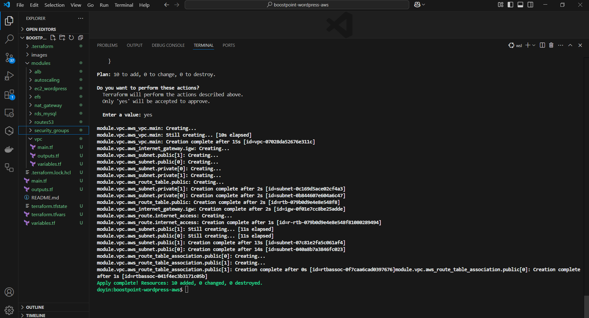
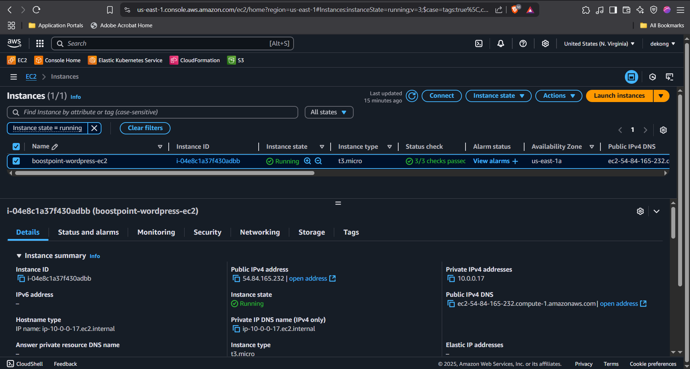
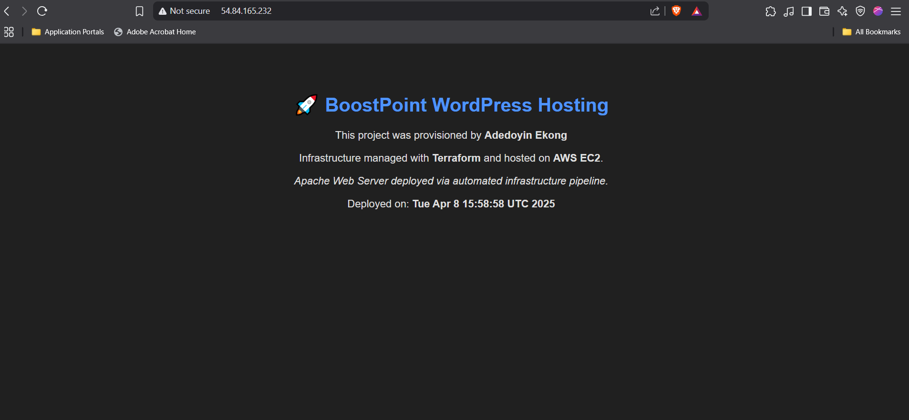
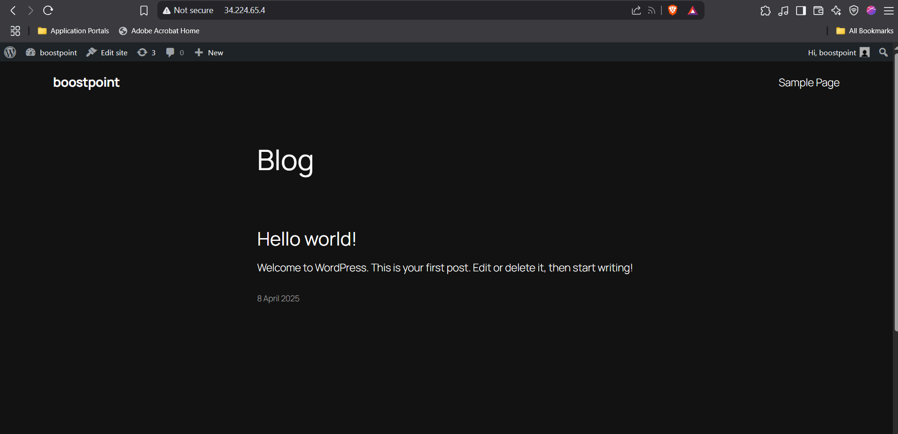
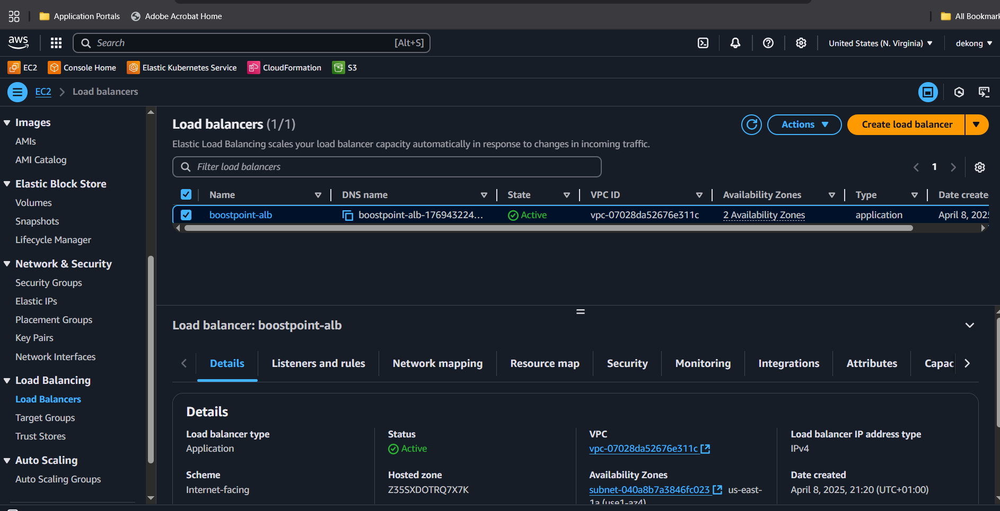
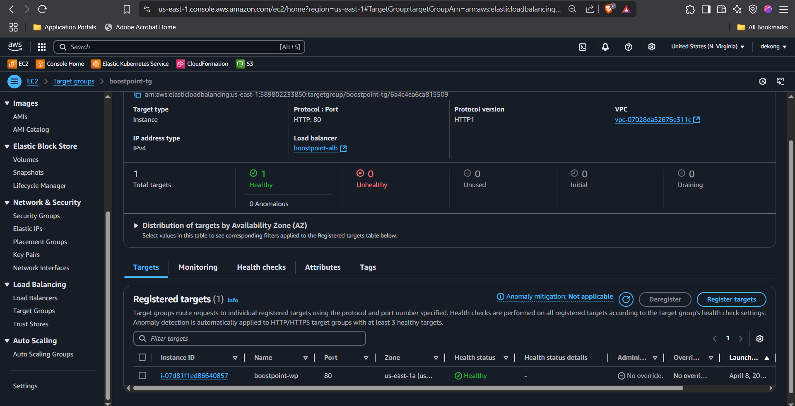
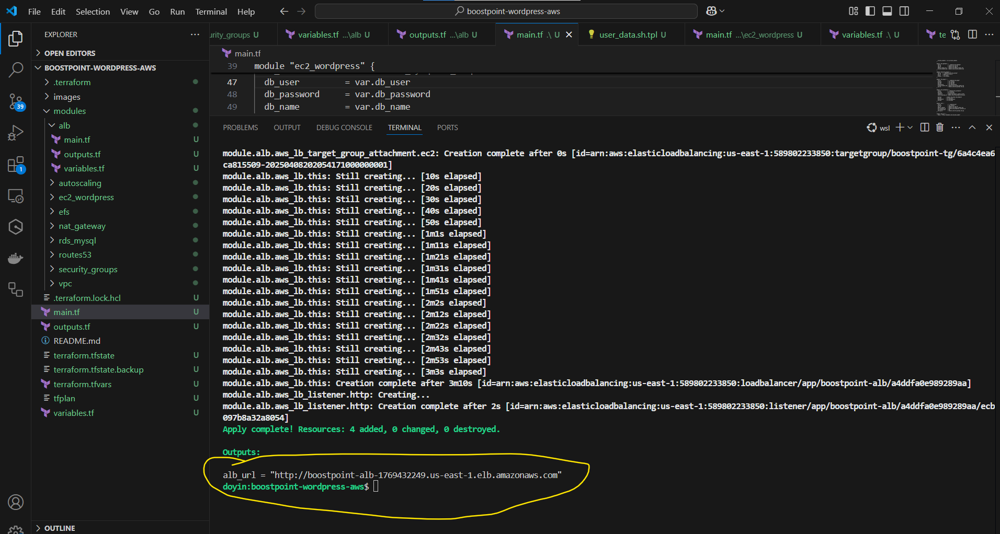
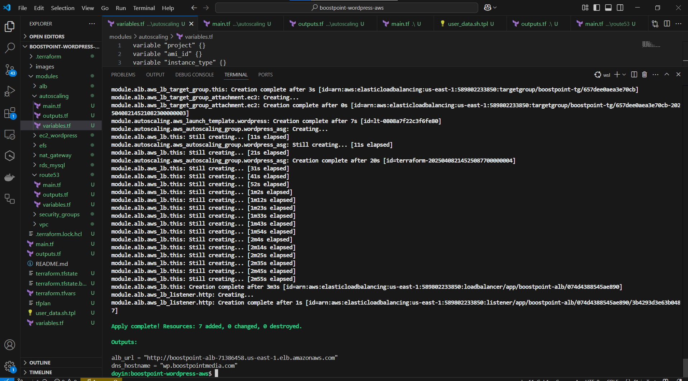
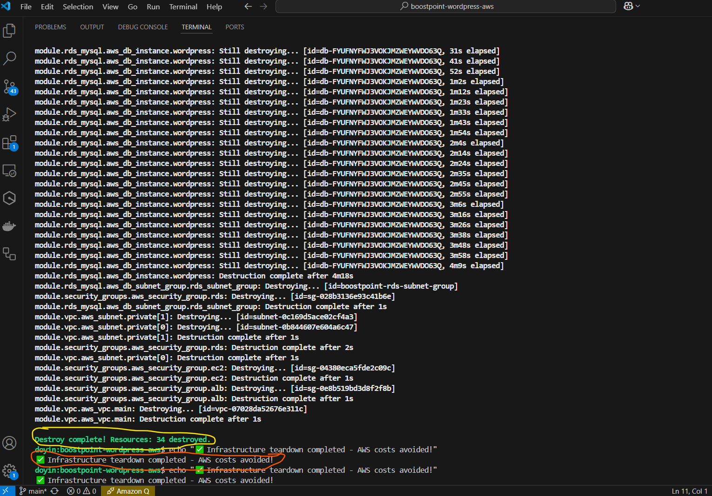

# 📸 BoostPoint AWS WordPress Infrastructure – Visual Gallery

This gallery visually documents each stage of infrastructure provisioning using **Terraform** for deploying WordPress on AWS.

🎥 All steps are recorded and will be shared as a silent YouTube playlist.

---

## 🧱 1. VPC + NAT Gateway Provisioning

| Action | Screenshot |
|--------|------------|
| Terraform VPC module completed |  |
| NAT Gateway & route tables created | _(recorded in videos)_ |

---

## 🔐 2. Security Groups

| Action | Screenshot |
|--------|------------|
| EC2 + ALB + RDS security groups defined | _(Defined in Terraform)_ |
| User IP allowed for SSH (restricted) | _No public screenshot for security_ |

---

## 💻 3. EC2 + Apache + WordPress Setup

| Action | Screenshot |
|--------|------------|
| EC2 instance running WordPress |  |
| Custom landing page deployed |  |
| WordPress homepage validated |  |

---

## 🛡️ 4. Load Balancer (ALB)

| Action | Screenshot |
|--------|------------|
| ALB Created |  |
| Target group healthy |  |
| Output DNS printed |  |

---

## 💽 5. RDS (MySQL) Integration

| Action | Screenshot |
|--------|------------|
| RDS launched privately |  |
| EC2 connected to RDS via `wp-config.php` | _(defined in user_data)_ |

---

## 🔁 6. Auto Scaling Setup

| Action | Screenshot |
|--------|------------|
| ASG + Launch Template created |  |
| WordPress scaling ready | _(Recorded in `autoscaling_prov.mp4`) |

---

## 🌐 7. DNS Simulation (Route53)

| Action | Screenshot |
|--------|------------|
| Simulated output for DNS name | _(Defined in outputs.tf)_ |

---

## 🧯 8. Teardown

| Action | Screenshot |
|--------|------------|
| Teardown via `terraform destroy` |  |

---

## 🎞️ Videos Playlist (Coming to YouTube)

| Step | Video |
|------|-------|
| VPC + NAT Setup | `vpc_provisioning.mp4` |
| EC2 + Apache Setup | `wordpress provisioning.mp4` |
| WordPress Validation | `wordpressfinaloutput.mp4` |
| RDS Integration | `RDS PROVISION.mp4` |
| ALB Infra + Outputs | `ALB INFRA PROVISIONING.mp4` |
| Auto Scaling | `autoscaling_prov.mp4` |
| Teardown | `Terraform destroy.mp4` |
| Final EC2 Test | `wordpress ec2.mp4` |
| Configs Explained | `variables.tf walkthrough.mp4` |

---

📁 **All screenshots are in** `images/`  
🎞️ **All videos are in** `YouTube`

---

_This visual gallery is part of a larger GitHub project showcasing real-world infrastructure deployment using best practices in DevOps._

